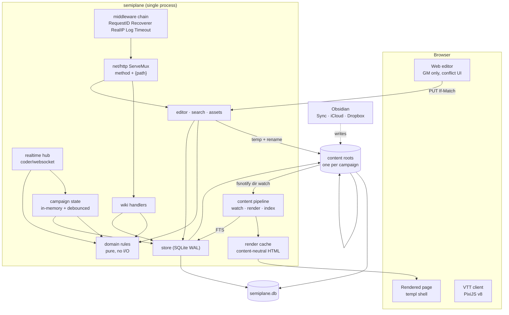
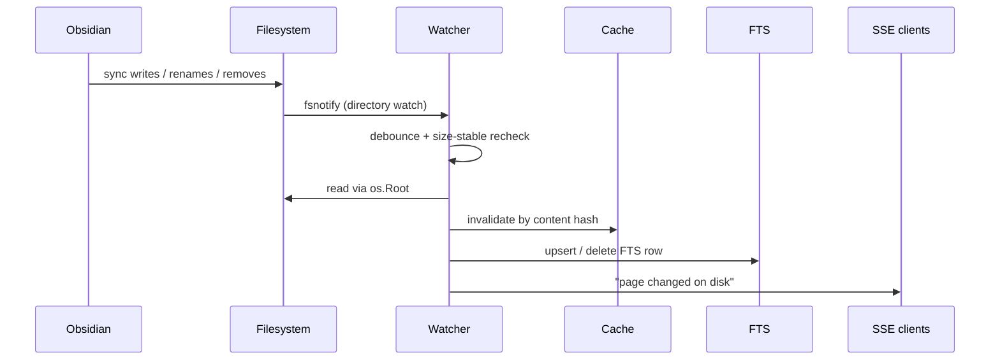

# semiplane — Technical Architecture Overview

Refined design overview. Repo state: bare scaffold (`cmd/server`,
`internal/config`, `internal/httpapi`, three empty packages). No Chi present,
so nothing to unwind.

---

## 1. Scope, and the one load-bearing constraint

A self-hosted TTRPG wiki plus virtual tabletop. One binary, one process, one
SQLite file, campaign content in a local Obsidian vault.

**In scope:** content pipeline, campaign registry, access control, web editor with
conflict resolution, real-time game state, WebSocket protocol, search, assets,
and the plugin system (§10).

**Out of scope:** voice/video (WebRTC), combat automation, mobile clients,
multi-instance HA, horizontal scaling, and third-party runtime plugin loading —
plugins are compiled-in modules, not dynamically loaded extensions.

### 1.1 Single process is a hard constraint

Authoritative game state lives in memory; the WebSocket hub is process-local.
**Two instances behind a load balancer will silently diverge.** SQLite's
single-writer limit is not the constraint — in-memory state ownership is.

Acceptable for self-hosted single-table use. If it ever changes, a shared broker
is required *before* anything else. Record this in `AGENTS.md` so nobody
"helpfully" scales it.

---

## 2. Decisions

Every version verified against upstream on 2026-09-30.

| Concern | Choice | Version | Rationale |
|---|---|---|---|
| Language | Go | 1.27.1 | `net/http`, `log/slog` |
| Router | `net/http` ServeMux | stdlib | Go 1.22+ native method+pattern routing. Chi dropped; it also carries open-redirect advisories `GO-2025-3770` / `GO-2026-4316`. |
| Templating | templ | v0.3.1020 | Compiles to Go; v0.3.1020 added concurrent component rendering (#1359). Still v0.x — pin exactly. |
| Live UI | Datastar | SDK v1.2.2 | SSE. Scoped to live UI only — never content delivery, never the map. |
| Realtime | coder/websocket | current | Not gorilla: advisory `GO-2026-6278` (weak PRNG for mask key) plus panics on concurrent writes. |
| Map render | PixiJS v8 | current | WebGL retained mode; same engine Foundry uses. |
| DB driver | modernc.org/sqlite | v1.58.0 | Pure Go, FTS5 compiled in by default. mattn/go-sqlite3 needs `-tags fts5` *and* gcc. |
| Search | SQLite FTS5 | — | External-content table over `pages`. |
| Markdown | goldmark | **v1.8.5** | Not v2.0.0-rc.1 (RC, zero importers). |
| YAML | goccy/go-yaml | current | Front matter + `vtt/` game objects. |
| CSS | Tailwind v4 standalone CLI | pin | No Node. Avoid pure-Go ports (`tailwind-go` = `Imported by: 1`). |
| Watch | fsnotify | v1.9.0 | Non-recursive; one watch per directory. |

### 2.1 Terminology (previously overloaded — now fixed)

| Term | Meaning |
|---|---|
| **Campaign** | A tenant. One content root, one membership list, one live tabletop, one gameplay system. |
| **Page** | One `.md` file. All content — prose *and* game objects — is a page. |
| **Game object** | A page with a registered `kind` (built-in: `token`, `scene`, `handout`, `journal`, `index`). A *definition*, durable, Obsidian-editable. |
| **Ruleset** | The resolved rule configuration for a campaign: gameplay plugin + data pack overlay + enabled house-rule modules. Has a `ruleset_version`. |
| **Placement** | A game object instance on a live map. **Runtime only.** Position, current HP, conditions. |
| **Campaign state** | The single in-memory + persisted row holding all live placements and turn state. |
| **Auth session** | A login. Distinct from all of the above. |

There is no `world` and no `session` game entity. A campaign has at most one live
tabletop.

### 2.2 Roles

`campaign_members.role ∈ {gm, player}`. **GM-only content editing**; players
participate in games only. Plus an instance-level `users.is_admin` for campaign
registration. Role stays a clean two-value enum with no ambiguous middle.

---

## 3. Architecture



### 3.1 templ and Datastar are not rivals

- **templ** renders the shell and chrome. Compiled Go, no runtime template language.
- **Datastar** patches live DOM over SSE, for genuinely reactive fragments:
  initiative tracker, chat log, presence.

Content is **never** delivered over Datastar. Filesystem markdown is cacheable
and static within a session, so it ships as ordinary HTTP with `ETag`. SSE appears
in exactly two places: live game chrome, and the editor's external-change notice.

---

## 4. Data model

```sql
-- identity
users(id, username UNIQUE, email, password_hash, is_admin, created_at)
auth_sessions(token_hash PRIMARY KEY, user_id, created_at, expires_at)

-- tenancy
campaigns(id, slug UNIQUE, name, content_root, visibility,
          system_id, ruleset_version, created_at)
--   content_root: absolute path to this campaign's vault
--   visibility:   'private' | 'public'
--   system_id:    gameplay plugin this campaign resolves with, e.g. '5e-2024'
--   ruleset_version: ruleset the persisted state was last written under
campaign_members(campaign_id, user_id, role, created_at,
                 PRIMARY KEY(campaign_id, user_id))
--   role: 'gm' | 'player'

-- content: filesystem is the source of truth, this is an index
pages(id, campaign_id, path, kind, title, body_plain, content_hash,
      front_matter, updated_at, deleted_at,
      UNIQUE(campaign_id, path))

-- all live game state: exactly one row per campaign
campaign_state(campaign_id PRIMARY KEY, state, version, updated_at)

-- history (git is not usable: two writers, content outside git)
page_revisions(id, campaign_id, path, content, author_id, source, created_at)
--   source: 'web' | 'obsidian' | 'system'   ('obsidian' ⇒ author_id NULL)
audit_log(id, campaign_id, actor_id, action, target, detail, created_at)

-- secret callouts: the FILE is authoritative for current revealed-ness;
-- this table is authoritative for who/when, and for re-applying a revert (§5.6)
secrets_revealed(campaign_id, path, anchor, revealed_by, revealed_at,
                 reverted_count DEFAULT 0,
                 PRIMARY KEY(campaign_id, path, anchor))
--   anchor: stable per-callout id so renames do not lose the ledger

CREATE VIRTUAL TABLE pages_fts USING fts5(
  title, body_plain, content='pages', content_rowid='id',
  tokenize='unicode61 remove_diacritics 2'
);
```

`body_plain` excludes secret callout content entirely, in every reveal state, so
a search snippet can never carry secret text to a non-GM (§5.6.4).

### 4.1 `kind` discriminates; only opted-in pages are validated

A page with no `kind` is prose. The VTT loader considers **only** pages whose
`kind` is a registered game-object kind. A malformed front-matter block in a lore page
is therefore inert — it cannot break the loader. This dissolves the concern that
unifying prose and objects would let arbitrary pages break the VTT.

The set of recognised kinds is **registry-backed, not a fixed enum** — see
§10.7. Built-ins register `token`, `scene`, `handout`, `journal`, `index`; a UI
plugin may add more. An unknown `kind` still degrades to prose, so removing a
plugin never destroys content.

### 4.2 Definitions are files; placements are runtime

| | Stored in | Written by |
|---|---|---|
| Token max HP, AC, portrait, size | page front matter | GM, via web or Obsidian |
| Placed token position, current HP, conditions, visibility | `campaign_state` | gameplay only |

**Placements must never be written to files.** If current HP lived in front
matter, every damage event would rewrite the file and collide head-on with
Obsidian sync — a permanent conflict storm. This is a hard rule, not a
preference.

### 4.3 FTS5 specifics

`tokenize` deliberately avoids `porter`: TTRPG proper nouns stem badly. Use
`unicode61 remove_diacritics 2`. External-content tables cannot be `ALTER`ed —
bulk changes require `INSERT INTO pages_fts(pages_fts) VALUES('rebuild')`.

---

## 5. Content pipeline

Event-driven, not request-time. Web editor and Obsidian converge on one path.



### 5.1 Watch directories, never files

Atomic writes (temp in same dir → `fsync` → `os.Rename`) are mandatory, but
fsnotify documents the consequence:

> *"If a file is removed (perhaps during a remove-rename atomic update cycle),
> fsnotify will stop watching it, and the watch needs to be replaced… Due to the
> gap between removal and watch replacement, the file should also be directly
> checked."*

A **directory** watch survives files inside it being replaced. One `fsnotify.Watcher`
for all campaigns; route events by path prefix. Linux defaults:
`max_user_instances=128` (instances are scarce), `max_user_watches=124983`
(watches are per-directory, not per-file).

### 5.2 Partial writes

fsnotify's own docs warn of *"significant danger of reading a half-written
file… `IN_CLOSE_WRITE` isn't exposed with fsnotify, so you just have to take
care."* Obsidian Sync and iCloud both burst.

1. Per-path debounce — reset timer on each event, fire on quiet.
2. Size-stable confirmation — re-`stat`, require unchanged size across two samples.
3. Ignore dotfiles and `.tmp` / `.swp` / `~` suffixes.

Time-debounce alone is documented as unreliable (3s insufficient for 100MB writes,
fsnotify #553). Markdown is small; shared assets are not.

### 5.3 Watch failure modes

| Failure | Detection | Response |
|---|---|---|
| Watch limit exhausted | `Add` → ENOSPC/EMFILE | Log loudly, fall back to periodic full rescan. **Never silent.** |
| Root missing at boot | `os.Stat` | Campaign `degraded`; server still starts |
| Root removed later | watch error | Mark degraded, retry with backoff |
| Symlink in tree | policy | **Reject by default** — fsnotify: *"behavior is uncertain and definitely undocumented"* |
| Watch binds inode not name | renames missed | Re-verify tree at startup and on a slow timer |

### 5.4 Render pipeline

```
bytes → front matter (separate; never reaches renderer)
      → goldmark: GFM + Footnote + Typographer, WithAutoHeadingID
      → extensions: [[wikilink]], ![[embed]], {{statblock]], {{dice]], [!secret]
      → redact secrets (§5.6) unless the viewer is the campaign GM
      → sanitize
      → tier-aware HTML → render cache (keyed with include_secrets)
      → plain text, secrets excluded → pages.body_plain (FTS)
```

Redaction happens **before** sanitize and before the value ever reaches a
template, so no intermediate buffer holds an unredacted copy for a non-GM.

**Never `html.WithUnsafe()`.** goldmark already refuses raw HTML and dangerous
links by default. With a public tier and Obsidian sync as an input, this is a
security boundary, not a style choice.

**Link resolution** is Obsidian-compatible: `[[Page]]` links,
`![[Page]]` embeds page content, `![[image.png]]` embeds an asset. Resolve by
relative path first, then by basename index within the campaign, then within
campaigns the viewer can see — never probe invisible ones. Record unresolved
links at index time for a broken-link report.

### 5.5 Cache keys

Rendered output is **permission-neutral by construction**, with one deliberate
exception: `[!secret]` callouts (§5.6), whose body differs by viewer. Chrome
always differs and is never cached.

- Key: `(campaign_id, path, content_hash, include_secrets)`
- `include_secrets` is true **only** for a campaign GM. Everyone else — members,
  players, anonymous readers of a public campaign — gets the redacted variant,
  so there are exactly two variants per page, never a per-user cache.
- Validity: **content hash, not mtime** — sync paths preserve or coarsen mtime,
  and 1-second filesystem granularity lets distinct writes collide
- `ETag` = the same hash, so browser and server caches share one invalidation signal
- Campaign in the key automatically partitions public from private

Because a reveal is written into the file, it changes `content_hash` and both
variants invalidate through the ordinary watcher path. No special-casing.

### 5.6 Secret callouts

Markdown may mark GM-only content with an Obsidian-compatible callout:

```markdown
> [!secret]-
> The traitor is Captain Aldric. He replaced the eastern signal fire.

> [!secret]+
> *Revealed to the party on 3 Frostfall.*
```

`-` is a secret, collapsed and GM-only. `+` is revealed and public. The single
character is the whole edit, which keeps the diff to one byte and minimises the
window for a collision with Obsidian's own line handling. Unknown callout types
render in Obsidian as generic callouts, so `secret` does not require an Obsidian
plugin to look correct.

This is the **only** feature that makes rendered body content viewer-dependent,
and it is scoped tightly on purpose.

#### 5.6.1 Redaction, not hiding

The secret body is **absent from the response** for non-GM viewers. It is not
`display:none`, not a `hidden` attribute, not an inline comment, and not a CSS
class — every one of those ships the text in the HTML, where any player can
recover it from view-source or the inspector.

Non-GM viewers receive the callout **removed entirely**. The default is omission
rather than a stub, because a placeholder still discloses the *existence* and
*position* of a secret, which is itself information in many games. A per-campaign
"render a redacted stub" option is available for tables where the GM wants the
prose to read naturally; it is opt-in, never the default.

#### 5.6.2 Reveal is a file write, so it must converge against sync

Revealing rewrites the markdown. The file is authoritative for whether a secret
is currently revealed; `secrets_revealed` in SQLite is authoritative for **who
revealed it and when**, and for re-applying a reveal that sync reverted.

This is a deliberate precedence rule, not an ambiguous two-source split:

| Question | Authority |
|---|---|
| Is this secret revealed right now? | the file |
| Who revealed it, when, and was it reverted? | `secrets_revealed` |

Because Obsidian syncs a copy that predates the reveal, it will periodically
overwrite a revealed callout back to `-`. The watcher must therefore reconcile:

1. On any change to a page, parse each secret callout's current marker.
2. Diff against the ledger for previously-revealed secrets that are now `-`.
3. Re-apply the `+` marker via the ordinary atomic write with `If-Match`.
4. If step 3 conflicts (a concurrent edit), back off and retry on the next event.

**Bounded, and failing toward secrecy.** Re-application is capped — say 3 passes
per file per minute. On exhaustion, log loudly and **leave the secret hidden**.
An accidentally revealed secret is a far worse outcome than a reveal that
arrives late or is dropped, so every failure path in this subsystem resolves
toward hiding.

#### 5.6.3 Anchor identity

The ledger is keyed by an `anchor`, which must survive editing a secret's text —
otherwise editing a revealed secret orphans its row and the next sync reversion
re-applies a reveal that has since been moved.

Resolution order:

1. **Obsidian block reference.** If the callout carries a `^block-id`, that is
   the anchor. Stable across any edit, and idiomatic in an Obsidian vault.
   `> [!secret]+ The traitor is Aldric. ^traitor`
2. **Derived anchor**, when the author supplied no block id:
   `sha256(campaign_id, path, ordinal, first-line-of-body)[:12]`, where
   `ordinal` is the callout's position among secrets on the page.

The derived form is stable across body edits *below the first line* but not
across a first-line rewrite, a reorder, or an insertion above it. That is
acceptable because the fallback is best-effort and self-healing: when the
watcher finds a ledger row whose anchor no longer resolves, it re-associates by
`ordinal`, carries the revealed state across, and logs a `secret_anchor_drift`
event. It never silently drops a reveal.

Anchors are also why renames are survivable: a page move re-keys the ledger on
`(campaign_id, new_path, anchor)` and leaves a tombstone for the old path.

#### 5.6.4 Role and audit

Reveal and unreveal are GM-only, and go through the same authorization and
`If-Match` precondition as any other write. Every reveal is written to
`audit_log` and to `secrets_revealed(campaign_id, path, anchor, revealed_by,
revealed_at, reverted_count)`. `reverted_count` makes the sync fight visible
rather than mysterious.

#### 5.6.5 Interaction with search and export

**Secret text never enters the FTS index.** `body_plain` excludes callout
content outright, regardless of reveal state, so a search snippet can never leak
a secret to a player or an anonymous reader. The tradeoff is that secrets are
not full-text searchable; a secret-aware index is an additive later change.

Session exports to journal pages exclude secret content by default.

#### 5.6.6 What this does not protect against

Anyone with filesystem access to the vault sees every secret, revealed or not —
the callout is hidden from *viewers of the rendered site*, not encrypted on disk.
The GM's Obsidian vault, its sync provider, and any device syncing to it are all
inside the trust boundary. This is the same boundary the whole content model
already has, but it is worth stating explicitly because secrets invite the
assumption that they are protected.

---

## 6. Editing and conflict resolution

Two independent writers, no shared lock:

```
10:00  A opens page in web editor  (served hash H1)
10:05  Obsidian syncs               (disk is now H2)
10:10  A saves                      (H2 lost, no error)
```

A file lock cannot fix this — Obsidian is a separate process unaware of
semiplane. Use an HTTP-native optimistic precondition.

```
GET /c/{slug}/edit/{path...}          → 200, ETag: "H1"
PUT /c/{slug}/edit/{path...}  If-Match: "H1"
   → 200 + new ETag      (matched)
   → 412 + current body  (disk is H2)     ← RFC 9110 for failed If-Match
```

### 6.1 Write path

1. Auth: session valid **and** `role = 'gm'` for the campaign.
2. Read current file, hash it, compare to `If-Match`.
3. Mismatch → 412, return current content and its hash, record nothing.
4. Match → append `page_revisions` (`source='web'`), write temp in same
   directory, `fsync`, `os.Rename`.
5. Return new ETag. The watcher's own event re-renders and re-indexes; the save
   path does not force either.

**No silent overwrite. No last-write-wins fallback.**

### 6.2 Conflict UI (v1)

Side-by-side: user's buffer (from H1) against current disk (H2), per-hunk
accept/reject, then save with `If-Match: "H2"`. Deliberately not a 3-way merge
in v1 — but `page_revisions` holds the common ancestor (H1), so a real merge is
additive later rather than a rewrite.

---

## 7. Real-time plane

`coder/websocket` at `GET /c/{slug}/ws`. The map canvas is **never** a Datastar
element: templ renders shell and sidebar, PixiJS owns one `<div>` and everything
inside it. Datastar patches the DOM *around* the canvas.

Browsers allow ~6 concurrent HTTP/1.1 connections per origin and every SSE stream
holds one permanently. So: **no SSE on the VTT page.** SSE appears only for live
game chrome and editor change-notification. HTTP/2 removes the ceiling entirely
(a deployment recommendation, not a code change).

### 7.1 Protocol

Clients send **intent**, never state. The server validates permissions and turn
order, applies, increments `version`, broadcasts.

```jsonc
// client → server
{"t":"hello","since":42}
{"t":"intent","seq":7,"op":"move_token","args":{"placement":"p1","x":420,"y":180}}
{"t":"intent","seq":8,"op":"roll","args":{"expr":"1d20+5","reason":"perception"}}
{"t":"presence","args":{"cursor":[120,88],"focus":"p1"}}

// server → client
{"t":"snapshot","version":43,"state":{…},"you":{"id":"u1","role":"gm"}}
{"t":"applied","seq":7,"version":44,"op":"move_token","args":{…},"by":"u1"}
{"t":"rejected","seq":7,"reason":"not_your_turn"}
{"t":"delta","version":45,"changes":[{"op":"set_hp","placement":"p1","hp":7}]}
{"t":"presence","users":[{"id":"u1","cursor":[120,88]}]}
{"t":"clock","world_time":"2026-09-30T14:00:00Z","paused":false}
```

- `seq` — client sequence, for optimistic reconcile
- `version` — server monotonic version, the ordering authority
- Reconnect sends `since` for a delta instead of a full snapshot
- `roll` is evaluated **server-side**; the client never supplies a result

### 7.2 Authority

Server-authoritative. Clients apply optimistically, reconcile on version
mismatch. Per-placement version, not global. GM-only ops (`pause`, `set_hp` on
another token, secret reveal) enforced server-side; client-side hiding is
cosmetic. Presence is ephemeral, never persisted.

### 7.3 Persistence cadence

`campaign_state` lives in memory, written on a **trailing debounce** (~2s after
last mutation) and on shutdown. A table produces a handful of writes per minute
instead of hundreds per second, so SQLite's single-writer limit never binds.
This is the main reason SQLite is adequate here.

Crash floor: the last debounced state. Mid-game restart resumes from it.

### 7.4 Chat and recaps

No session entity, so chat is an in-memory ring buffer per campaign, lost on
restart. An explicit **"export to journal"** action writes a `kind: journal`
markdown page — which fits the unified content model, creates a
`page_revisions` row, and is therefore recoverable and Obsidian-editable.

---

## 8. Access control

| Tier | Scope | Capability |
|---|---|---|
| Instance admin | global | Register campaigns, manage users |
| Campaign GM | one campaign | Full content edit, game control, invite |
| Campaign player | one campaign | Play only; **no content write** |
| Anonymous | `visibility='public'` only | Read-only wiki and public assets |

Games always require membership; `public` grants wiki read only.

---

## 9. URL scheme

```
/c/{slug}/wiki/{path...}       page, ETag, cacheable, secret-redacted for non-GM
/c/{slug}/edit/{path...}       editor (GM only)
/c/{slug}/secrets/{path...}    reveal / unreveal, GM only, If-Match (§5.6)
/c/{slug}/assets/{path...}     assets, Range, visibility-gated
/c/{slug}/search?q=            FTS5
/c/{slug}/play                 VTT (members only)   — no session id
/c/{slug}/ws                   WebSocket upgrade
/c/{slug}/events               SSE (editors + live chrome)
/healthz  /readyz
```

Slug in the path partitions every cache and CDN key by visibility, which is what
makes a shared cache safe when public and private campaigns coexist.

---

## 10. Plugin system

### 10.1 Taxonomy — three tiers, not two

Plugins are **compiled-in Go modules** registered at the composition root. Their
purpose is to keep rules and presentation in separate packages with their own
tests, not to load third-party code at runtime.

| Tier | Authority | Ships as | Examples |
|---|---|---|---|
| **Gameplay plugin** | Resolves intents into state mutations | Go package + `go:embed` data packs | D&D 5e 2024, 5e 2014 |
| **UI plugin** | Reads state; declares page types and render hooks. **Never writes state.** | Go package + templ components + JS | link previews, graphical dice roller |
| **Theme layer** | None | Plain files in the campaign content root | CSS, header background, fonts |

Two corrections to the original brief:

1. **House rules are a gameplay plugin**, not a UI modifier — they change
   mechanics. The UI modifier category as stated does not exist.
2. A modifier that only adds CSS is **not a plugin**. It is the theme layer,
   served from content, with no code and no authority.

A second, orthogonal axis — **scope**:

| | *Defines* a system | *Patches* an instance |
|---|---|---|
| **Gameplay** | 5e 2024, 5e 2014 | House rule modules |
| **UI** | (unused — no benefit) | Link previews, dice roller |

### 10.2 The structural difference, stated precisely

> **A gameplay plugin defines the operation vocabulary and resolves it into
> mutations. A UI plugin may only emit operations that some gameplay system
> already resolves.**

Everything else follows from that sentence:

| | Gameplay | UI | Theme |
|---|---|---|---|
| Runs | server | browser (+ templ SSR) | browser |
| Input | intent + state + seeded RNG | DOM events, render query | CSS cascade |
| Output | `[]Mutation` | DOM / Datastar patches | nothing |
| Writes `campaign_state` | yes | **never** | never |
| Determinism required | **yes** | no | no |
| Registration | `internal/plugin` | `internal/web/plugins` | none — content files |
| Can define a new `op` | yes | no | no |
| Failure blast radius | campaign state | one browser tab | one browser tab |

### 10.2.1 Kind ownership — a plugin does not own what it does not need

`semiplane` owns the page kinds that are not about rules. A gameplay plugin
declares only rules-content kinds. This matters because it is what allows a
system sharing nothing with 5e — Pathfinder, Starfinder — to register its own
`ancestry` or `feat` without colliding with, or being blocked by, 5e's vocabulary.

| Owner | Kinds | Rationale |
|---|---|---|
| semiplane — wiki | `journal`, `handout`, `index` | Content, not rules. No plugin should redeclare these. |
| semiplane — VTT, system-agnostic | `token`, `scene` | Present on every map in every system. Parameterised by the system, not defined by it. |
| **gameplay plugin** | `spell`, `class`, `feat`, `creature`, `ancestry`, … | Genuinely system-specific. Declared via `ContentKinds()`. |

`token` and `scene` being semiplane-owned is the load-bearing part: the PixiJS
map layer renders placements, fog, and initiative order without knowing any
rules, so a new system needs no client work at all.

### 10.3 Gameplay contract

```go
// internal/domain/rules
type System interface {
    ID() ID          // stable; stored in campaign_state, never renamed
    Title() string
    RulesetVersion() string

    // This system's expression notation, so the client can preview and
    // validate a roll before sending it. A d20 system and a 2d6-pool system
    // describe different grammars; the protocol never assumes d20.
    Grammar() Grammar
    Parse(expr string) (Expr, error)

    // Apply a validated intent. Returns mutations for the hub to version and
    // broadcast — a system can never forge a broadcast or skip versioning.
    Apply(ctx Context, state *State, in Intent) ([]Mutation, error)

    // Data for the UI: modifiers, DCs, sheet summaries. Opaque to semiplane.
    Derive(state *State, q Query) (any, error)

    // How this system wants that data rendered. Each view is either backed by
    // a templ component shipped by the plugin, or served by a built-in generic
    // renderer (stat block, key-value, list). See §10.6.
    Views() []View

    // Rules-content kinds this system defines: spell, class, feat, creature,
    // ancestry. NOT token, scene, journal, handout, or index — those belong to
    // semiplane. See the ownership table in §10.2.1.
    ContentKinds() []Kind
}
```

`Context` carries the seeded RNG, campaign identity, actor identity, and actor
role — never a wall clock and never an ambient random source.

**Determinism is a discipline requirement, not a sandbox.** Because these are
compiled-in packages there is no isolation layer, so rule code is forbidden from
calling `time.Now`, ranging over a map, or calling `crypto/rand` directly. The
enforcement is a lint rule plus tests. Rationale: `campaign_state` supports
optimistic client apply, resume-by-version, and replay, all of which break if
resolution is not a pure function of (state, intent, seed).

### 10.4 Data packs

A pack is `go:embed`ed YAML, versioned with the code: stat blocks, conditions,
reference tables, and the set of `kind`s the system recognises.

A shared engine plus data packs plus a narrow Go escape hatch is the chosen
split, because 5e 2014 and 5e 2024 are ~90% identical:

```
base pack (shared 5e data)
  ├── overlay:  2014  — race naming, crit on 20 only, no mastery properties
  └── overlay:  2024  — species, mastery properties, crit on any natural 20
resolver hooks (the escape hatch, only where data genuinely cannot express it)
```

The differences show up as reviewable data diffs. Only genuinely procedural rules
— weapon mastery resolution, 2024 crit — become Go hooks.

**Overlay is one strategy among several, not a requirement.** It applies only
where two systems are closely related. A plugin sharing nothing with 5e — say
Pathfinder — ships one complete standalone pack and its own resolver hooks, and
implements `System` without touching `internal/domain/rules`, the engine, or
semiplane itself. The only shared code is the interface, the intent and mutation
types, and the shared conformance suite (§14).

The engine is therefore *shared 5e mechanics*, not "the rules engine". Systems
with nothing in common do not use it.

### 10.5 House rules: gameplay × patch

House rules are applied at campaign load to produce an *effective* ruleset:

```
system ID → base pack → overlay → enabled house-rule modules (declared order)
         → effective ruleset (+ ruleset_version)
```

Two hard constraints:

- **House rules are data-level, not code-level.** A house rule may toggle
  `flanking_optional`, change a DC formula constant, or disable a condition. It
  may not reorder resolution or introduce nondeterminism — otherwise replay and
  audit die. This is what keeps house rules auditable and shareable.
- **Application order is explicit and deterministic.** Modules carry a
  `position`; conflicts resolve first-match-wins and are logged, never
  last-write-wins.

### 10.6 UI contract, and how system views are rendered

A UI plugin registers one or more of:

- **page types** — a new `kind` plus its route handler and templ component
- **render hooks** — participation in the markdown pipeline for a block
- **state observers** — Datastar patches driven by WebSocket deltas

Constraints:

- Read access to state is filtered by the viewer's campaign visibility, exactly
  as the wiki is.
- A UI plugin **cannot write** `campaign_state`. It dispatches the same intents a
  human player would, so it passes identical authorization and validation.
- It cannot register a new `op`. Only a gameplay system defines those.

**Worked consequences:**

| Plugin | Behaviour |
|---|---|
| **Graphical dice roller** | Renders a die widget in chat. On send, emits `{"op":"roll"}` and renders the server's result. It must **not** roll client-side — a client-side roll is unverifiable and would break the audit trail. |
| **Link preview** | Render hook on external links. The server-side unfurl helper is read-only and returns `{title, description, image}`. It must not become a path for reading private campaign content. |
| **House-rules widget** | Displays which house rules are active. Read-only; the rule data itself comes from a gameplay module, never from the UI. |

#### 10.6.1 System-specific views are server-rendered

A character sheet, spell list, or DC summary shares almost nothing between 5e,
Pathfinder, and Starfinder. `Derive` returns opaque data; something must decide
how it becomes HTML.

**Rendering is server-side templ, chosen by the system.** `Views()` declares
views; each is either backed by a templ component the plugin ships, or served by
a built-in generic renderer — stat block, key/value, list, tag cloud. A simple
plugin ships data and zero UI code; a rich one ships Go templates.

Three consequences worth stating, because they are why this choice:

1. **No second language per plugin.** A gameplay plugin is Go plus YAML. There
   is no client-side rendering contract to version and no plugin JavaScript.
2. **The mutation vocabulary stays server-side.** Datastar already patches DOM
   from server-rendered fragments, so the client never interprets a
   system-specific mutation. This was unstated and is the main reason server-side
   rendering is preferable to a client-renderer contract.
3. **The client surface stays small.** PixiJS renders placements, fog, and
   initiative order — all system-agnostic (§10.2.1). A new system therefore adds
   no client work.

The accepted limitation: a plugin cannot have a richly interactive character
sheet with live client-side editing. Editing happens in the markdown editor
instead, which is Obsidian-compatible anyway. If that limitation later hurts, it
is additive — a `ClientView` can be added alongside templ without changing
`Derive`.

### 10.7 Schema additions

```sql
-- campaigns gains a system and a ruleset version
ALTER TABLE campaigns ADD COLUMN system_id TEXT NOT NULL DEFAULT '5e-2024';
ALTER TABLE campaigns ADD COLUMN ruleset_version TEXT NOT NULL DEFAULT '';

CREATE TABLE campaign_rule_modules (
  campaign_id  TEXT NOT NULL REFERENCES campaigns(id),
  module_id    TEXT NOT NULL,
  enabled      INTEGER NOT NULL DEFAULT 1,
  config       TEXT NOT NULL DEFAULT '{}',
  position     INTEGER NOT NULL DEFAULT 0,
  PRIMARY KEY (campaign_id, module_id)
);
```

`kind` becomes **registry-backed** rather than the fixed enum written elsewhere in
this document: built-ins register `token`, `scene`, `handout`, `journal`,
`index`; a UI plugin may register additional kinds at startup. Validation is
still opt-in — unknown `kind` means prose.

### 10.8 Plugin failure modes

| Condition | Behaviour |
|---|---|
| `system_id` unknown (plugin removed or renamed) | Campaign refuses to start a game and says which ID it wants. **Wiki still serves.** |
| `ruleset_version` differs from persisted state | Refuse to resume rather than silently misresolve; prompt the GM to start a new session |
| House-rule conflict | First-match-wins by `position`, logged with both module IDs |
| Gameplay plugin panics inside `Apply` | `recover()` at the `Apply` boundary; return an error; **state is not mutated** because mutations are returned, never applied in place |
| UI plugin throws client-side | Contained to that browser tab; server unaffected |
| Stale `kind` after a plugin removal | Page degrades to prose; content is never lost — it is a file on disk |

That last row is why `kind` is safe to extend: an unknown kind is inert, not
fatal, and the markdown is always recoverable.

---

## 11. Module structure

```
cmd/server/                thin main: config, wiring, signals
internal/config/           env parsing, no project deps
internal/domain/           pure types + rules, no I/O
internal/domain/rules/     System, Intent, Mutation, Expr contracts
internal/domain/systems/   gameplay plugins (dnd5e: engine + embedded packs,
                           overlays for 2014/2024, house-rule modules)
internal/plugin/           registry + composition-root wiring (no init() magic)
internal/store/            SQLite, migrations, FTS
internal/content/          os.Root, watcher, front matter, render, cache, game objects
internal/realtime/         hub, campaign state, protocol codec
internal/httpapi/          handlers + middleware chain
internal/web/              templ components, static assets
internal/web/plugins/      UI page-type and render-hook registration
```

`domain` imports nothing from the project. `content`, `realtime`, and
`domain/systems` depend on `domain/rules`; `httpapi` depends on all.

Registration is explicit in the composition root (`cmd/server`), not `init()`.
`init()`-based registration hides ordering and leaks state between tests, both
of which become real problems once rules packs are versioned.

---

## 12. Security boundaries

| Boundary | Requirement |
|---|---|
| Path traversal | `os.Root` (Go 1.24+) per campaign, created at registration — **not** `filepath.Clean` + prefix check. Applies to writes and to every path in front matter. |
| Stored XSS | No `html.WithUnsafe()`, ever. Sanitize before caching. |
| Untrusted disk content | Obsidian sync is untrusted input — shared vaults, plugins, compromised devices. Validate all YAML and resolve all paths within `os.Root`. |
| YAML bombs | Front matter is attacker-reachable; use a parser with alias-expansion limits, or cap document size. |
| Search leakage | FTS queries must join `campaigns` on visibility; a bare query returns private titles to anonymous users. |
| Asset leakage | Assets inherit campaign visibility; never share a cache entry across campaigns. |
| Auth parity | WebSocket upgrade authenticates identically to HTTP. Presence cursors leak positions — gate them. |
| WebSocket origin | Enforce `Origin` explicitly on upgrade. |
| Plugin authority | A UI plugin must never reach `campaign_state`; it may only dispatch intents a gameplay system resolves. Enforce structurally — gameplay `Apply` returns mutations, so no plugin can write state or forge a broadcast in place. |
| **Secret redaction** | Secret callout bodies must be absent from every non-GM response — never CSS-hidden, commented out, or deferred client-side. The redaction happens in the render, before templ output. **Highest-value security test in this plan** (§14). |
| **Secret reconciliation** | Sync-driven re-application is capped and fails toward hidden. Never retry unboundedly, and never resolve a conflict by revealing. |
| Rule determinism | Rule code must not call `time.Now`, iterate maps, or use ambient `crypto/rand`. Enforce by lint rule and tests — there is no sandbox, because plugins are compiled in. |
| House-rule scope | House rules are data-level only. A module that reorders resolution or introduces nondeterminism is rejected, because replay and audit depend on determinism. |
| Supply chain | `datastar-go` is young (207★, 24 commits) but is plain `net/http` — cheap to escape. templ is v0.x; pin exactly. |

---

## 13. Failure modes

| Condition | Behaviour |
|---|---|
| Content root missing | Campaign `degraded`; server starts; others unaffected |
| inotify exhaustion | Loud error + periodic full rescan |
| Mid-write read | Debounce + size-stable; drop and retry once |
| Stale editor save | 412 + current content; user reconciles |
| Mass WS disconnect | Presence cleanup; reconnect with `since` → deltas |
| SQLite busy | Single writer goroutine + `busy_timeout`; never a pool of writers |
| Crash mid-game | Resume from last debounced `campaign_state` |
| Cache miss | Re-render synchronously; cache is never a dependency |

### 13.1 Operational concerns

- **Bootstrap:** no user can exist before the DB. Provide
  `semiplane admin create --username X` as a CLI subcommand (runnable via
  `docker exec`) rather than a bootstrap env var, so no secret sits in the
  environment.
- **Migrations:** forward-only under `internal/store/migrations/`. FTS5 virtual
  tables cannot be altered — schema changes there require drop + recreate +
  `'rebuild'`.
- **Backups:** two artifacts that can desync. Back up the content root *and* a
  consistent SQLite snapshot (`.backup` API or `VACUUM INTO`, not a raw file
  copy while running). The content root is the source of truth for pages; the DB
  is a rebuildable index plus `campaign_state`.
- **Retention:** `page_revisions` is unbounded. Keeping all is acceptable for v1
  (small text); add a per-page cap if Obsidian sync churn proves noisy.

### 13.2 Observability

Four subsystems fail silently by default, which is the specific risk here: a
watcher that stops watching, a cache that serves a stale tier, a reconciliation
loop that quits, and a hub that leaks connections. Each needs a signal that is
cheap to assert on and impossible to ignore.

`slog` is the only mechanism — no metrics server, no tracing stack. Emit
structured events with a stable `event` key so they are greppable and
alertable-on, plus expose counters on `/readyz` as JSON.

| Signal | Type | Why it matters |
|---|---|---|
| `watch.add_failed` | error, per campaign | Watch exhaustion is the highest-impact silent failure. Must be an error, never a debug line. |
| `watch.degraded` / `watch.recovered` | state per campaign | Content root went away or came back |
| `watch.rescan_fallback` | counter | Fallback engaged because watches were lost |
| `content.stable_read_timeout` | counter | Debounce never settled — a writer is stuck mid-write |
| `content.render_error` | error, with campaign + path | Never serve a broken page silently |
| `cache.hit` / `cache.miss` | counter, by tier | A permanently-zero `include_secrets` hit rate means the GM view is being regenerated every request |
| `conflict.412` | counter by campaign | Elevated rate means Obsidian and the web editor are fighting |
| `secret.reverted` | counter | Sync is undoing a reveal — the single most surprising failure this system can have |
| `secret.anchor_drift` | warn | Ledger re-association happened (§5.6.3) |
| `secret.reconcile_capped` | **error** | Reconciliation exhausted its budget and left the secret hidden |
| `ws.connected` / `ws.closed` / `ws.stale` | gauges | Detect leaks; `ws.stale` fires when a peer stops reading |
| `state.write_ms` | histogram | Debounced persistence latency; a spike means the writer is contended |
| `plugin.missing` / `plugin.version_mismatch` | error | Unknown `system_id` or `ruleset_version` (§10.8) |

The three rows marked as the ones that must never be below `error` are the
security-relevant ones: `secret.reconcile_capped` in particular is the system
telling you it *chose* to hide something and a sync fight is unresolved.

Every event carries `campaign_id` and, where applicable, `path`. No event carries
secret content, file contents, or dice results.

---

## 14. Validation strategy

| Area | Method |
|---|---|
| Markdown rendering | Golden files; assert raw HTML in input is stripped |
| Partial-write safety | Burst-write a file; assert cache never holds a truncated parse |
| Watch loss on rename | Atomic-write a page; assert it still re-renders |
| Conflict detection | Stale `If-Match` → 412, disk unchanged, no revision written |
| Role enforcement | `player` PUT → 403; `anonymous` PUT → 401/404 |
| Cache partitioning | **Security test:** private page body must never appear in a public response |
| FTS visibility | Anonymous search must not return private rows |
| FTS lifecycle | Obsidian-style rename / delete / undelete → index converges |
| Realtime | Two clients, concurrent intents, assert convergence + monotonic versions |
| Persistence | Kill mid-game; assert resume from last debounce |
| Concurrency | `go test -race` across hub, cache, watcher |
| Rule determinism | Property test: same (state, intent, seed) → identical mutations across 100 runs |
| Ruleset drift | Resume a session written under a different `ruleset_version` → refuse, do not silently re-resolve |
| Plugin isolation | Panic inside `Apply` → recovered, error returned, `campaign_state` byte-identical to before |
| Plugin authority | A UI plugin attempting to mutate state → cannot; assert no write path is reachable |
| Unknown `kind` | Page with a `kind` no plugin registers → degrades to prose, content intact |
| Missing plugin | Campaign with unknown `system_id` → game refused, wiki still serves 200 |
| 2014 vs 2024 parity | Shared property suite runs green against both overlays |
| **Plugin conformance** | A published suite every `System` must pass: determinism, unknown-`kind` tolerance, version/migration refusal, GM-only enforcement, `Apply` panic containment. **A system sharing nothing with 5e must pass it without touching `internal/domain/rules`.** This is the test that the plugin system actually generalises. |
| View rendering | Every declared view renders for an empty, a typical, and a maximal `Derive` output; unknown fields are ignored, not fatal |
| **Secret redaction** | For a page containing a secret: GM response contains the body, player response does **not**, anonymous response does **not**, and neither contains the secret text anywhere in the payload — headers, comments, JSON payloads, or HTML source |
| Secret reveal | Reveal rewrites `-` → `+`, logs an audit row, and is visible to players on the next render |
| Secret sync conflict | Simulate Obsidian reverting `+` → `-`; assert the watcher re-applies, counts the reversion, and **stops after the cap leaving it hidden** |
| Secret concurrency | Stale `If-Match` on a reveal → 412, file unchanged, no ledger row |
| Secret search | A query matching only secret text returns nothing to any role; snippets never contain secret text |
| Secret + cache | After a reveal, both cache variants invalidate on the new `content_hash`; a stale non-GM variant is never served |
| Observability | Assert each event in §13.2 is emitted by its trigger; assert no event payload contains secret or file content |
| Gate | `make ci` — format, build, vet, golangci-lint, `-race` |

---

## 15. Implementation order

Sequenced by dependency, not by effort.

1. **Foundations** — middleware chain; config for SQLite path and content-root
   base; `admin create` CLI; migration skeleton.
2. **Identity and tenancy** — `users`, `auth_sessions`, `campaigns`,
   `campaign_members`; auth middleware; campaign registration and `os.Root`
   creation.
3. **Content read path** — `os.Root` confinement; front matter + `kind`
   discrimination; goldmark render + sanitize; wikilink/embed extensions; render
   cache; `ETag`.
4. **Watcher** — fsnotify directory watches, debounce + size-stable, FTS
   maintenance, degraded mode, `campaign_state` schema.
5. **Wiki surface** — templ shell and chrome; `wiki` / `edit` routes; `If-Match`
   write path; conflict UI; SSE change-notification; search; assets with Range.
6. **Realtime** — in-memory `campaign_state`; hub; protocol codec; placements vs
   definitions; GM-only operations; debounced persist; resume by `version`.
7. **Plugin contracts** — `domain/rules` interfaces; `plugin` registry wired in
   the composition root; UI page-type and render-hook registration.
8. **First systems** — 5e engine + base pack, then the 2014 and 2024 overlays and
   their resolver hooks; two reference UI plugins (link preview, dice roller) to
   prove both contracts are usable.
9. **House rules** — `campaign_rule_modules`, ordered application, ruleset version
   gating on resume.
10. **Client** — PixiJS canvas; Datastar live chrome; Tailwind standalone build;
    theme layer served from content.
11. **Secret callouts** — `[!secret]` goldmark extension; two-variant render;
    `include_secrets` cache key; GM-only reveal endpoint with `If-Match`;
    `secrets_revealed` ledger; bounded sync reconciliation; FTS exclusion.
12. **Hardening** — the security tests above, race coverage, failure-mode tests,
    determinism lint rule and its tests. The secret-redaction test gates the
    release: it must fail loudly if a non-GM response ever contains secret text.

Each phase is independently runnable: the server starts and serves `/healthz`
from phase 1 onward. Phases 7–9 are separable — a build with no gameplay plugin
still serves the wiki, and a campaign with an unknown `system_id` degrades to
wiki-only rather than failing to boot. Phase 11 comes late because it refines an
already-working render pipeline, and because it needs the access control (phase
2), watcher (phase 4), and conflict-resolution (phase 5) layers underneath it.

---

## 16. Open questions

Deliberately deferred, with a default chosen for v1:

1. **Cross-campaign wikilinks** — resolution already respects viewer
   permissions. Whether authors should be able to *write* them is a product call.
   Default: allowed within campaigns the viewer can see.
2. **Asset storage beyond local disk** — maps are tens of MB. Local disk with
   Range requests is the self-hosted answer; leave a seam for S3-compatible
   storage rather than building it.
3. **Dice expression scope** — expressions only, no system-specific semantics.
   The seeded RNG is supplied via `Context` rather than called directly (§10.3),
   which makes a per-session seed + roll log auditable at no extra cost; that log
   is the natural follow-up if trust becomes a concern.
4. **Player wiki editing** — settled as GM-only. If a group wants shared notes,
   Obsidian already covers it, and `editor` can be added to the enum later
   without a migration.
5. **Ruleset version drift** — the policy is "refuse to resume on mismatch"
   (§10.8). Whether semiplane should instead auto-migrate state forward, or warn
   and let the GM continue, is unresolved. Default: refuse, because silently
   misresolving past state is worse than an extra click.
6. **Plugin API stability** — gameplay plugins are compiled in, so there is no
   semver contract to honour across releases. `Intent`/`Mutation`/`Kind` are
   therefore semi-public. If plugins ever move out-of-tree, these need versioning
   before that happens.

### 16.1 Blocking dependency: the UI/UX spec is stale

`.kilo/plans/1790778908232-responsive-ui-ux-design-spec.md` (1,209 lines) was
written against an earlier revision of this plan and still describes entities
this plan **removed** when the tenancy model was simplified. It correctly defers
to this plan for semantics (its own lines 8–10), so the drift is in its
vocabulary and route tables, not its intent.

**Stale references to fix before that spec is implemented:**

| Location | Says | This plan says |
|---|---|---|
| line 60 | `world` — the `worlds` table, and a `world` field in the WebSocket `hello` | No `world` entity. `hello` is `{"t":"hello","since":N}` (§7.1) |
| line 61 | `game` — the `sessions` table and `/c/{slug}/play/{session}` | No play-session entity. Route is `/c/{slug}/play` (§9) |
| lines 68–71 | Interface vocabulary rules premised on a `{session}` URL parameter | No such parameter exists |
| line 76, 312, 404 | TV target, nav label, and route table all address `/c/{slug}/play/{session}` | `/c/{slug}/play` |
| line 102 | Checklist item banning a second meaning of "session" across `internal/` | Moot as written; §2.1 now fixes the terms directly |

Lines 884–885 also say "world units" but mean map coordinate space, which is a
standard graphics term and is **not** affected.

**Also missing entirely:** any UI treatment of `[!secret]` (§5.6). The
architecture now specifies that secret bodies are absent from non-GM responses,
which has four direct UI consequences the spec does not cover:

1. The GM reveal affordance — a control in the editor surface, distinct from the
   ordinary save path because it is a disclosure action with its own audit row.
2. The player-facing redacted view, and the prose gap "omit entirely" leaves when
   a secret sits mid-sentence.
3. Theming for a revealed callout, distinct from a hidden one.
4. An accessibility decision: whether a redacted secret is announced to assistive
   technology at all, which risks disclosing its existence.

**Status:** deferred by decision — the spec is left untouched to avoid conflicting
with its author. Reconcile before either document is built, and treat it as a
blocker on UI work, not on backend work: phases 1–9 and 11 are unaffected.
